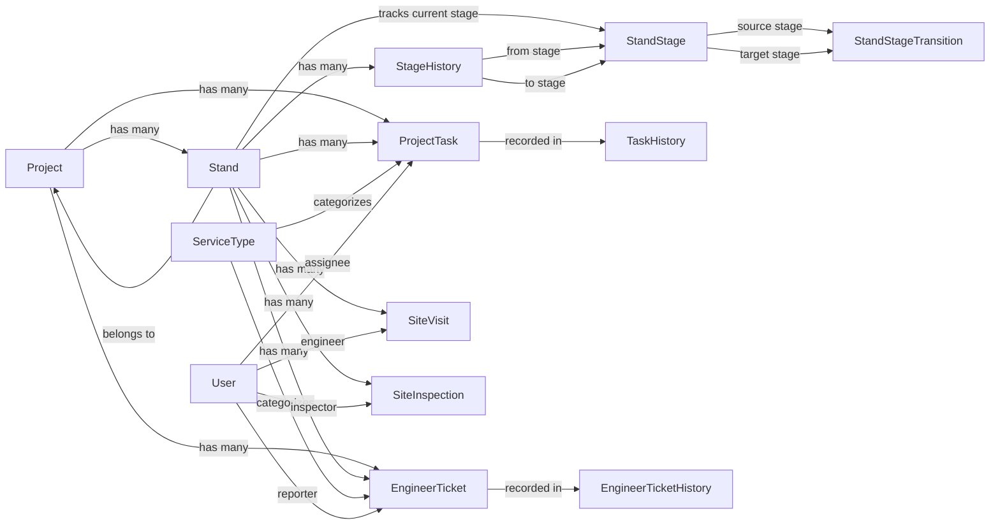

# MEIMS Core Workflow ER Diagram

This diagram captures the current stable implementation baseline for the core workflow modules implemented through Phase 20.

```mermaid
flowchart LR
    Project[Project]
    Stand[Stand]
    StandStage[StandStage]
    StandStageTransition[StandStageTransition]
    StageHistory[StageHistory]
    ServiceType[ServiceType]
    ProjectTask[ProjectTask]
    TaskHistory[TaskHistory]
    EngineerTicket[EngineerTicket]
    EngineerTicketHistory[EngineerTicketHistory]
    SiteVisit[SiteVisit]
    SiteInspection[SiteInspection]
    User[User]

    Project -->|has many| Stand
    Project -->|has many| ProjectTask
    Project -->|has many| EngineerTicket
    Stand -->|belongs to| Project
    Stand -->|has many| ProjectTask
    Stand -->|has many| EngineerTicket
    Stand -->|has many| SiteVisit
    Stand -->|has many| SiteInspection
    Stand -->|tracks current stage| StandStage
    StandStage -->|source stage| StandStageTransition
    StandStage -->|target stage| StandStageTransition
    Stand -->|has many| StageHistory
    StageHistory -->|from stage| StandStage
    StageHistory -->|to stage| StandStage
    ProjectTask -->|recorded in| TaskHistory
    EngineerTicket -->|recorded in| EngineerTicketHistory
    ServiceType -->|categorizes| ProjectTask
    ServiceType -->|categorizes| EngineerTicket
    User -->|assignee| ProjectTask
    User -->|reporter| EngineerTicket
    User -->|inspector| SiteInspection
    User -->|engineer| SiteVisit
```
